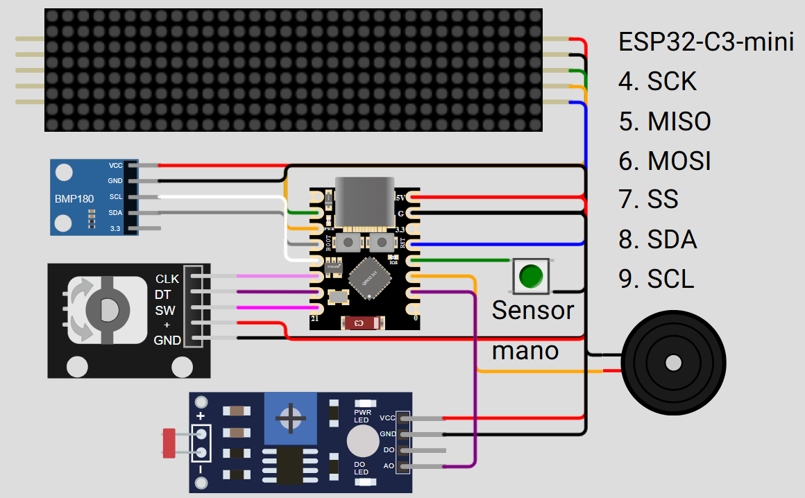

# Reloj multifunción con interfaz web (ESPUI)
Proyecto basado en ESP32; incluye:
- Configuración por WiFi (aprovisionamiento)
- Interfaz web (ESPUI)
- Modo despertador (estilo Philips Wake-up Lamp)
- Múltiples alarmas (recurrentes)
- Mensajes
- Etc..

## Para simular este proyecto en la computadora:
- Tener instalado Visual Studio Code.
- Instalar las extensiones PlatformIO y Wokwi
